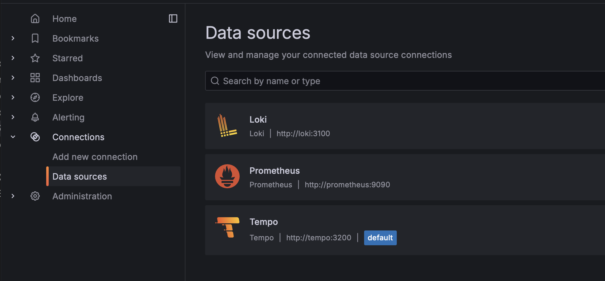
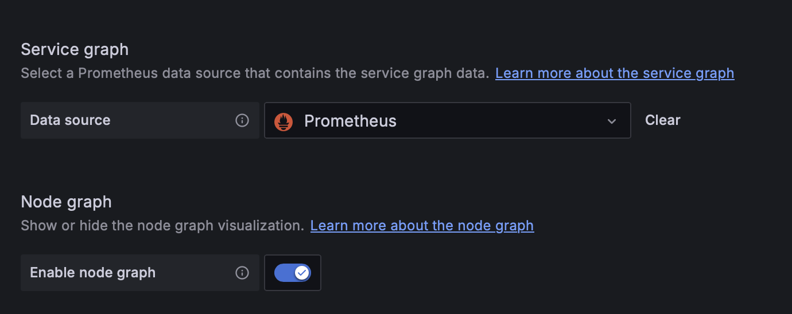
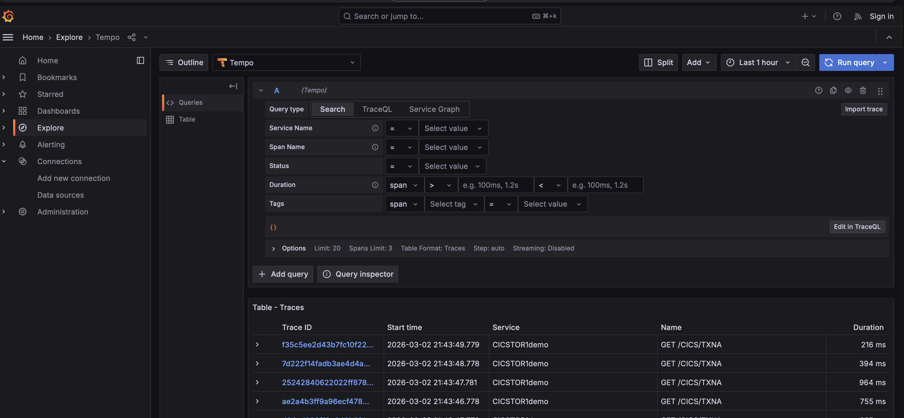
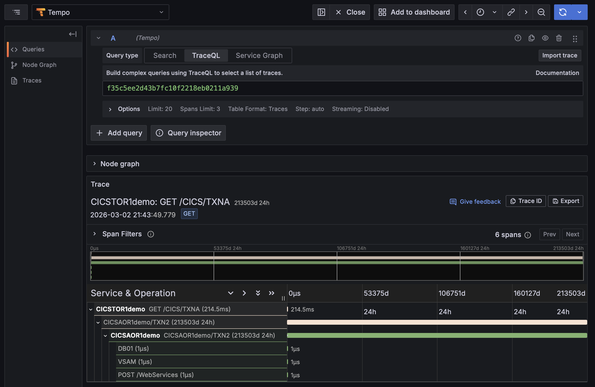
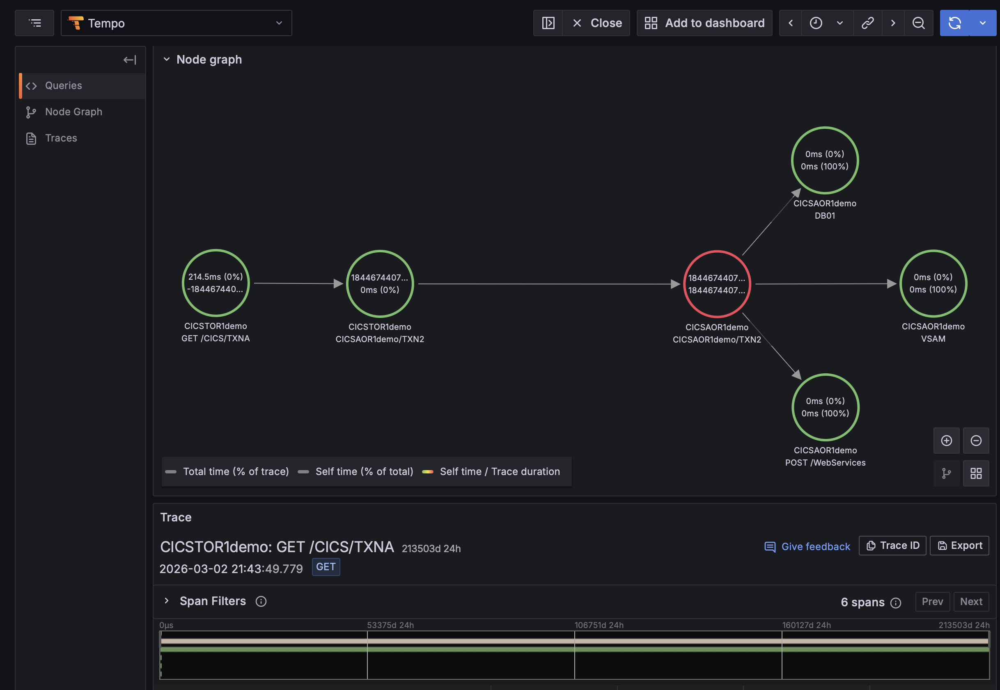
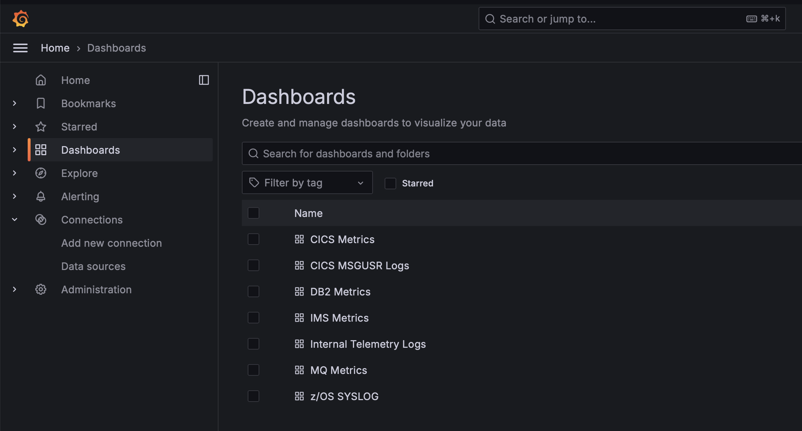
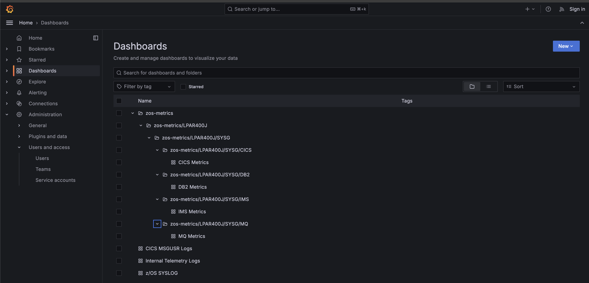
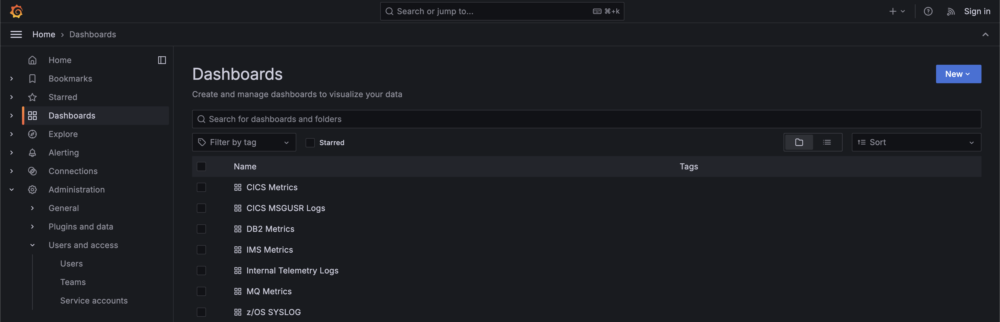

# ZOC Telemetry Controller Grafana Dashboards

Sample Grafana dashboards are provided to help visualize and validate telemetry generated by the Z Observability Connect (ZOC) Telemetry Controller. These dashboards serve as examples and as a starting point for exploring the z/OS metrics and log data available through ZOC.

To view these dashboards, several prerequisites must be in place, including Grafana, Prometheus, Tempo, and Loki. The instructions below outline two possible scenarios, depending on whether you already have these prerequisites in place.

For either scenario, you should first install the ZOC Telemetry Controller and Common Data Provider, configured with the ZOC metrics and logs policy. For reference on deploying Telmetry Controller or CDP metrics and log policies, refer to [Z Observability Connect documentation](https://www.ibm.com/docs/en/zapmc/7.1.0?topic=telemetry-controller). 

## Scenario 1: Deploy Grafana Stack (Grafana, Loki, Tempo, Prometheus, and ZOC Dashboards)

Use this scenario if you do not already have an existing Grafana stack. It guides you through deploying Grafana, Loki, Tempo, and Prometheus along with the ZOC dashboards.

### Prerequisites

A docker-compose.yaml file is included in this repository that contains deployment definitions for Grafana, Loki, and Prometheus. Using it requires either Docker Compose or Podman Compose to be available on your system.

Refer to these links for guidance on deploying Docker or Podman with Compose:

- [Docker](https://docs.docker.com/engine/install/)
- [Podman](https://developers.redhat.com/blog/2018/08/29/intro-to-podman#)
- [podman-compose](https://github.com/containers/podman-compose)

### Deployment

#### 1. Clone repository
```bash
git clone https://github.com/IBM/z-observability-connect.git
```

#### 2. Configure Prometheus to scrape targets

The ZOC Telemetry Controller exposes two Prometheus-style metric endpoints. Before deploying the Grafana stack, update `z-observability-connect/grafana-dashboards/config/tools/prometheus.yml` to point Prometheus to the correct endpoints. You must replace:

* `<telemetry-controller-fqdn>:<zos-metrics-port>`
* `<telemetry-controller-fqdn>:<internal-metrics-port>`

Use the information below to determine the correct ports based on how the Telemetry Controller was deployed.

-  z/OS metrics endpoint  
   - Default ports:  
     - 30889 when the Telemetry Controller is deployed using Helm  
     - 31889 when the Telemetry Controller is deployed using the telemetryctl CLI  
   - Purpose: Provides z/OS-related operational and performance metrics.

- Internal telemetry metrics endpoint  
   - Default ports:  
     - 30888 when the Telemetry Controller is deployed using Helm  
     - 31888 when the Telemetry Controller is deployed using the telemetryctl CLI  
   - Purpose: Provides internal controller telemetry such as component health and processing statistics.

Note: Telemetry Controller deployments created with Helm use ports beginning with 30xxx. Deployments created with the telemetryctl CLI use ports beginning with 31xxx.


#### 3. Deploy the Grafana stack

Before running this step, ensure you are in the `z-observability-connect/grafana-dashboards` directory, as Docker or Podman will need access to `z-observability-connect/grafana-dashboards/docker-compose.yaml`.

Docker:
```bash
docker compose up -d
```

Podman:
```bash
podman-compose up -d
```

#### 4. Update Telemetry Controller to Send Traces and Logs

Now that your Grafana stack is ready, you should configure the ZOC Telemetry Controller to export traces and logs to Grafana. This is done by updating `telemetry-controller/config/exporters.yaml`.

For logs, uncomment the `otlphttp` section and update the endpoint `http://<loki-backend>:3100/otlp`. The value for `<loki-backend>` should be the fully qualified domain name (FQDN) of the machine where the Grafana stack is deployed.

For traces, add a section to `exporters.yaml` to configure traces to export to Tempo in the Grafana stack. Here is an example:

```
otlp/tempo:
    pipelines: ["traces"]
    endpoint: "http://<tempo-vm-endpoint>:4317"
    tls:
      insecure: true
```
`tempo-vm-endpoint` is the FQDN of the machine where you deployed the Grafana stack. Port 4317 is the default gRPC port exposed by Tempo.

**IMPORTANT:** After updating `exporters.yaml`, you will need to redeploy the Telemetry Controller:
* `./telemetryctl stop`
* `./telemetryctl install`

You must run both stop and install for the configuration to take effect.

#### 5. Access Grafana

To access the Grafana UI, point your browser to `http://<fqdn>:3000`. The FQDN is the fully qualified hostname of the machine Grafana is deployed on. 

#### 6. Set Up Node Graph and Service Graph

To enable Node Graph and Service Graph views for trace, navigate to the Grafana UI: `http://<fqdn>:3000`. 

On the lefthand panel, go to `Connecton`->`Data Sources`. 



Click on `Tempo`, then scroll down to `Additional settings`. 



Under Service graph, upate the `Data Source` to be `Prometheus` and toggle `Enable node graph` to be enabled. 

Scroll to the bottom of the page and select `Save & test`.

#### 7. View Traces

Click `Explore` and then select the 'Search' tab. 



Click on a trace. 



Open the `Node graph` section which is located above `Trace`. 



#### 7. View Sample Dashboards for Metrics and Logs

To view the sample dashboards for Metrics & Logs, navigate to `Dashboards`.



#### 8. (Optional) Enable Dynamic Dashboard Mode

By default, the Grafana stack deploys with **static dashboards** - pre-configured dashboards that display all subsystems. For advanced users who want automatic dashboard organization by SYSPLEX/SYSTEM/SUBSYSTEM hierarchy, you can optionally enable **dynamic dashboard mode**.

**What is Dynamic Dashboard Mode?**

Dynamic mode automatically:
- Discovers z/OS subsystems from Prometheus metrics
- Creates hierarchical folder structure: `zos-metrics → SYSPLEX → SYSTEM → SUBSYSTEM`
- Generates type-specific dashboards for CICS, DB2, MQ, and IMS
- Monitors for new subsystems and creates dashboards automatically
- Organizes dashboards by your z/OS topology

**Dashboard Mode Comparison:**

| Feature | Static Mode (Default) | Dynamic Mode (Optional) |
|---------|----------------------|------------------------|
| Setup | Simple (docker-compose) | Requires API key + config |
| Organization | Flat list | Hierarchical (SYSPLEX/SYSTEM/SUBSYSTEM) |
| Subsystem Discovery | Manual | Automatic |
| Dashboard Updates | Manual | Automatic |
| Best For | Quick start, simple environments | Large environments, organized topology |

**Prerequisites for Dynamic Mode:**
- Grafana stack must be running (steps 1-7 above)
- Grafana API key with Admin role
- `jq` command-line tool installed (version 1.5+)
- `bash` version 4.0+ (for associative arrays)

**Enable Dynamic Dashboards:**

1. **Install jq** (if not already installed):
   ```bash
   # On RHEL/CentOS
   sudo yum install -y jq
   
   # On Ubuntu/Debian
   sudo apt-get install -y jq
   
   # Verify installation
   jq --version
   ```

2. **Generate Grafana API Key**:
   - Login to Grafana (http://localhost:3000)
   - Go to **Administration** → **Service Accounts**
   - Click **Add service account**
   - Name: `auto-dashboard-script`, Role: **Admin** (Editor role is insufficient)
   - Click **Add service account token**
   - Copy the generated token

3. **Configure dynamic dashboard settings**:
   ```bash
   # From the grafana directory
   vi config.env
   ```
   
   Update these settings:
   ```bash
   GRAFANA_URL=http://localhost:3000
   GRAFANA_API_KEY=<your-api-key-here>
   PROM_URL=http://localhost:9090
   CHECK_INTERVAL=10  # How often to check for new subsystems (seconds)
   ```

4. **Apply dynamic dashboards**:
   ```bash
   chmod +x apply-dynamic-dashboards.sh remove-dynamic-dashboards.sh dynamic-dashboards-status.sh
   ./apply-dynamic-dashboards.sh

   example:
      [root@sk-isl21 dynamic-dashboard]# ./apply-dynamic-dashboards.sh
      [2026-06-04 06:04:30] Loading configuration from /root/monitoring/dynamic-dashboard/config.env
      [2026-06-04 06:04:30] Validating Grafana connectivity...
      [2026-06-04 06:04:30] Validating Grafana API key...
      [2026-06-04 06:04:31] Validating Prometheus connectivity...
      [2026-06-04 06:04:31] Starting dynamic dashboard mode...
      [2026-06-04 06:04:31] Deleting static dashboards from Grafana...
      [2026-06-04 06:04:31] Updated DYNAMIC_MODE=true in config.env
      [2026-06-04 06:04:31] ✓ Dynamic mode started (PID: 3077083)
      [2026-06-04 06:04:31]   Log file: /root/monitoring/dynamic-dashboard/auto-sync.log
      [2026-06-04 06:04:31]   Use './dynamic-dashboards-status.sh' to check status
      [2026-06-04 06:04:31]   Use './remove-dynamic-dashboards.sh' to switch back to static mode
   ```
   
   This will:
   - Remove static dashboards from Grafana
   - Create dynamic dashboards organized by SYSPLEX → SYSTEM → SUBSYSTEM
   - Start background process to continuously monitor for new subsystems
   - Log output to `auto-sync.log`

5. **Check status**:
   ```bash
   ./dynamic-dashboards-status.sh

   example:
      [root@sk-isl21 dynamic-dashboard]# ./dynamic-dashboards-status.sh
      [2026-06-04 06:01:23] Loading configuration from /root/monitoring/dynamic-dashboard/config.env
      =========================================
      Grafana Dashboard Mode Status
      =========================================
      Current Mode: false

      Dynamic Sync Process: Not running
      =========================================
      [root@sk-isl21 dynamic-dashboard]#

   ```

   
   Output shows:
   - Current mode (static or dynamic)
   - Background process status
   - Number of deployed dashboards

6. **View logs** (optional):
   ```bash
   tail -f auto-sync.log
   ```

7. **Remove dynamic dashboards and switch back to static mode** (if needed):
   ```bash
   ./remove-dynamic-dashboards.sh

   example:
      [root@sk-isl21 dynamic-dashboard]# ./remove-dynamic-dashboards.sh
      [2026-06-04 06:11:49] Loading configuration from /root/monitoring/dynamic-dashboard/config.env
      [2026-06-04 06:11:49] Stopping dynamic dashboard mode...
      [2026-06-04 06:11:49]   ✓ Stopped background process (PID: 3077083)
      [2026-06-04 06:11:49] Deleting dynamic dashboards from Grafana...
      [2026-06-04 06:11:50]   ✓ Deleted dynamic dashboard folder: zos-metrics
      [2026-06-04 06:11:50]   ✓ Cleaned up state file
      [2026-06-04 06:11:50] Updated DYNAMIC_MODE=false in config.env
      [2026-06-04 06:11:50] ✓ Switched back to static dashboard mode
      [2026-06-04 06:11:50]   Static dashboards will be re-provisioned automatically
      [2026-06-04 06:11:50]   If they don't appear, restart Grafana: docker-compose restart grafana
   ```
   
   This will:
   - Stop the background monitoring process
   - Remove all dynamic dashboards from Grafana
   - Restore static dashboards (requires Grafana restart: `docker-compose restart grafana`)

**Important Notes:**

- **Mode Switching**: You can switch between static and dynamic modes at any time without losing data
- **Single Dashboard Source**: Both modes use the same dashboard templates from the `/dashboards` folder
- **Automatic Conversion**: The script automatically converts static dashboards to dynamic format when needed
- **Background Process**: Dynamic mode runs continuously in the background to discover new subsystems
- **State Management**: The script tracks deployed dashboards to avoid duplicates

**Troubleshooting:**

- If dashboards don't appear after switching modes, restart Grafana: `docker-compose restart grafana`
- Check logs for errors: `tail -100 auto-sync.log`
- Verify API key has Admin role (Editor role lacks folder creation permissions)
- Ensure Prometheus has z/OS metrics with required labels: `zos_sysplex`, `service_namespace`, `service_name`, `zos_smf_id`

**Example Dynamic Dashboard Hierarchy:**

```
zos-metrics/
└── LPAR400J/              # SYSPLEX
    └── SYSG/              # SYSTEM
        ├── CICS/          # Subsystem Type
        │   ├── CICSR01E   # Individual Dashboard
        │   └── CICSR02E
        ├── DB2/
        │   ├── DC1E
        │   └── DC1K
        ├── MQ/
        │   └── M31A
        └── IMS/
            └── IMS1
```



**Example Static Dashboard Hierarchy:**
```
├── CICS Metrics dashboard
├── DB2 Metrics dashboard
├── IMS Metrics dashboard
├── MQ Metrics dashboard
```



